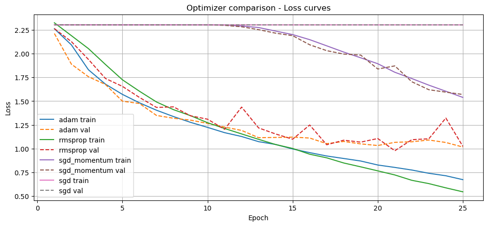
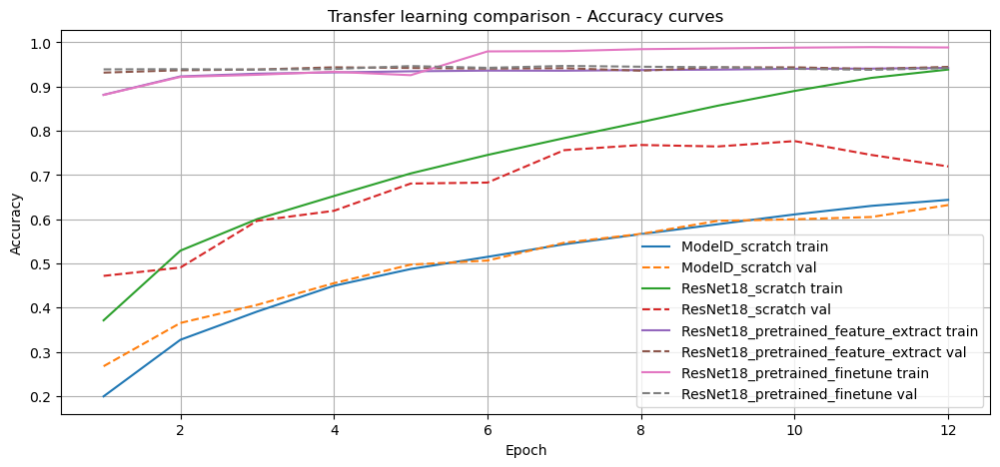
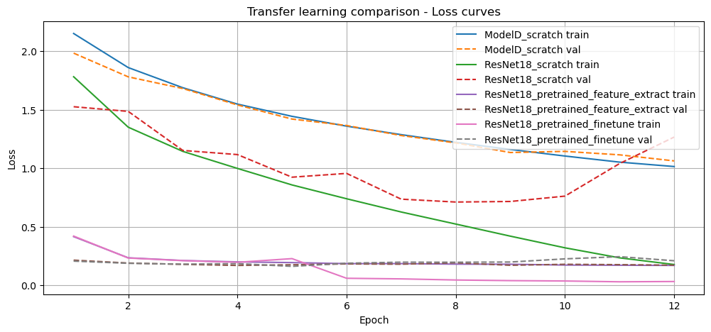

# CNN Architecture Study

Controlled experiments on image classification covering architecture depth,
hyperparameter tuning, regularization, optimization, and transfer learning.
All experiments use the same dataset and preprocessing pipeline to ensure
fair comparison across conditions.

> **Best result: 94.7% validation accuracy** with pretrained ResNet18 fine-tuning.
> Feature extraction reached 94.5% using only 5,130 trainable parameters.
> Training from scratch on the same backbone: 77.7%.

---

## Results

| Model | Best val acc | Best val loss | Trainable params |
|---|---|---|---|
| ResNet18 fine-tuned | **0.9468** | 0.1988 | 11.2M |
| ResNet18 feature extract | 0.9447 | **0.1730** | **5,130** |
| ResNet18 from scratch | 0.7768 | 0.7631 | 11.2M |
| ModelD from scratch | 0.6322 | 1.0639 | 305K |

All models trained for 12 epochs.

---

## Approach

Eight controlled experiments, each isolating one variable:

| # | Topic | What was varied |
|---|---|---|
| 1 | Depth comparison | Shallow vs. deep custom CNNs under identical setup |
| 2 | Hyperparameter tuning | Learning rate, batch size, weight decay |
| 3 | Generalization regimes | Underfitting, good fit, overfitting under controlled data budgets |
| 4 | Regularization | Dropout, weight decay, early stopping |
| 5 | Optimizer comparison | SGD, SGD with momentum vs. adaptive optimizers (Adam, RMSprop) |
| 6 | Advanced architectures | Custom CNN (ModelD) vs. DenseNet121 |
| 7 | Experiment tracking | Weights & Biases logging, Optuna hyperparameter search |
| 8 | Transfer learning | Pretrained vs. from-scratch ResNet18, feature extraction vs. fine-tuning |

---

## Key Findings

**Transfer learning dominates at limited training budgets.**
Both pretrained ResNet18 variants exceeded 0.94 validation accuracy within 12 epochs.
The best from-scratch model (ResNet18, 0.7768) remained far below, showing the
performance gap comes primarily from pretrained representations, not architecture alone.

**Feature extraction is the most parameter-efficient strategy.**
ResNet18 feature extraction reached 0.9447 validation accuracy with only 5,130
trainable parameters. The train-validation gap was essentially zero, indicating
stable generalisation without overfitting.

**Fine-tuning achieves the highest peak but overfits later.**
Fine-tuning reached the best single-epoch validation accuracy (0.9468 at epoch 7),
but the final train-validation gap (0.047) and high training accuracy (0.9885)
suggest the model began to overfit after the optimal checkpoint.

**Optimization and regularization matter as much as architecture.**
Earlier experiments showed the same model producing very different results depending
on learning rate, weight decay, and optimizer. Adaptive optimizers consistently
outperformed SGD variants, and mild weight decay gave the best generalisation balance.

---

## Visualisations

### Optimizer comparison

Adam and RMSprop converge clearly faster than SGD and SGD with momentum.
Plain SGD fails to make meaningful progress within 25 epochs under this setup.

### Transfer learning comparison

---

## Reproducibility

The dataset (iCoSimal V3) is course-internal and not publicly available.
The code, experiments, and findings are fully documented in the notebook.
